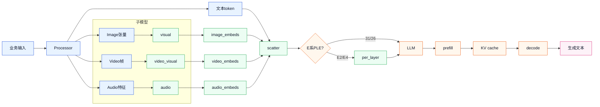
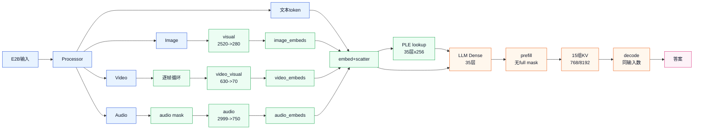
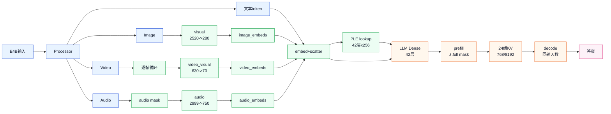
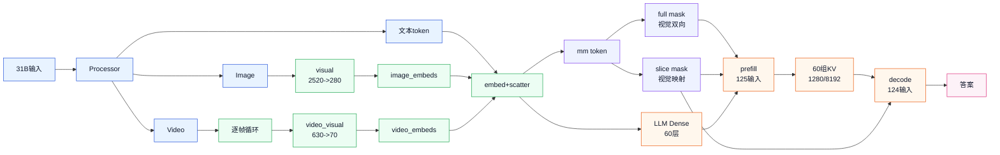
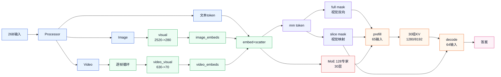

# Gemma4 Series Merak 统一 Workflow 使用与模型说明

日期：2026-06-21  
JIRA：QTL-384  
入口：`examples_merak/llm/gemma4_series`、`xhmodel_merak/xh_llm/models/gemma4_series`

## 1. 结论与推荐路径

Gemma4 Series 当前只推荐一个 public API：

```text
Gemma4ForConditionalGeneration
  -> AutoLLMWorkflow.from_config(...)
  -> xhmodel_merak.xh_llm.models.gemma4_series.workflow.Gemma4SeriesWorkflow
  -> xhmodel_merak.xh_llm.models.gemma4_series.XHGemma4SeriesModel
```

旧目录 `gemma4/`、`gemma4e/`、`gemma4_moe/` 只作为历史兼容面保留；新
导出、量化、golden、demo、评测不要再从旧目录或 `_with_mask` public key
进入。26B-A4B 的 MoE 差异由 `gemma4_series` 根据 HF `config.json` 自动
识别，调用侧仍使用 `Gemma4ForConditionalGeneration`。

当前推荐的最优精度组合如下，导出时复用已量化 HF 权重即可：

| 模型 | 推荐权重 | 量化 HF 目录环境变量 | 说明 |
|---|---|---|---|
| E2B | AutoRound | `GEMMA4_E2B_AUTOROUND_HF` | 当前 HMONNX 精度优于 GPTQModel |
| E4B | GPTQModel | `GEMMA4_E4B_GPTQMODEL_HF` | 当前 GPTQModel 稳定优于 AutoRound |
| 26B-A4B | AutoRound | `GEMMA4_26B_A4B_AUTOROUND_HF` | MoE 权重必须走 GPTQModel/Merak loader 读取 split experts |
| 31B | AutoRound | `GEMMA4_31B_AUTOROUND_HF` | 当前 CEval/HMONNX 对比最优 |

导出合同：

| 项 | 固定要求 |
|---|---|
| `context_max_length` | 正式集成/本轮产物使用 `8192`；轻量默认 YAML 为 `2048`，命令行可覆盖 |
| `prefill_chunk_length` / `input_sequence_length` | `256` |
| LLM export | `prefill` + `decode` 两张图 |
| KV cache | full attention 层：`context_max_length`；sliding 层：`sliding_window + 256` |
| `quant_scheme` | base/export 阶段也保持 `w8a8h1_sefp`，不要改成 `None` |
| base export | 只允许用 `config_overrides={"quant": None}` 跳过 workflow quant stage |
| golden | 每个子模块都要有 HM-style golden：`visual`、`video_visual`、`audio`、`prefill`、`decode` |
| video ViT | 必须单独导出 `video_visual`，不允许 pad 到 image ViT 的 2520 patch 图上 |

> 注意：本轮已产出的 8192 HMONNX 目录名里仍可能含 `_2k`，这是历史命名
> 问题；判断真实 context 以 `golden_meta_info.json` 里的
> `model_config.context_max_length` 为准。后续新导出已修正为按 context suffix
> 命名。

## 2. 四个模型结构与功能对比

### 2.1 能力矩阵

| 模型 | Text | Image | Video | Audio | PLE | MoE | Visual bidirectional attention | Public API |
|---|---:|---:|---:|---:|---:|---:|---:|---|
| E2B | ✅ | ✅ | ✅ | ✅ | ✅ | ❌ | ❌ | `Gemma4ForConditionalGeneration` |
| E4B | ✅ | ✅ | ✅ | ✅ | ✅ | ❌ | ❌ | `Gemma4ForConditionalGeneration` |
| 26B-A4B | ✅ | ✅ | ✅ | ❌ | ❌ | ✅ | ✅ | `Gemma4ForConditionalGeneration` |
| 31B | ✅ | ✅ | ✅ | ❌ | ❌ | ❌ | ✅ | `Gemma4ForConditionalGeneration` |

说明：

- E2B/E4B 有 audio tower 和 per-layer input embedding，文本图输入比 31B/26B
  多 `per_layer_inputs`。
- E2B/E4B 的 `use_bidirectional_attention` 不是 `vision`，所以视觉 token
  仍走纯 causal mask；prefill 不需要额外 `full_attention_mask`，slice-window
  mask 也不需要给视觉 token 开双向注意力。
- 31B/26B-A4B 的 `use_bidirectional_attention=vision`，视觉 token 组内部需要
  双向可见；prefill 多一个 `full_attention_mask`，decode 不带这个输入；
  slice-window mask 也要把视觉 token 组映射到截断后的 cache 坐标内。
- 26B-A4B 是 MoE，量化/加载要保证 split experts 正确，不要用会丢 expert
  或错误拼接 MoE 权重的 loader。

### 2.2 关键 HF config 差异

| 字段 | E2B | E4B | 31B | 26B-A4B |
|---|---:|---:|---:|---:|
| `hidden_size` | 1536 | 2560 | 5376 | 2816 |
| `num_hidden_layers` | 35 | 42 | 60 | 30 |
| `num_attention_heads` | 8 | 8 | 32 | 16 |
| `num_key_value_heads` | 1 | 2 | 16 | 8 |
| `num_global_key_value_heads` | - | - | 4 | 2 |
| `head_dim` | 256 | 256 | 256 | 256 |
| `sliding_window` | 512 | 512 | 1024 | 1024 |
| `layer_types` | 28 sliding + 7 full | 35 sliding + 7 full | 50 sliding + 10 full | 25 sliding + 5 full |
| `enable_moe_block` | false | false | false | true |
| `num_experts` | - | - | - | 128 |
| `hidden_size_per_layer_input` | 256 | 256 | 0 | 0 |
| `num_kv_shared_layers` | 20 | 18 | 0 | 0 |
| `attention_k_eq_v` | false | false | true | true |
| `use_bidirectional_attention` | - | - | `vision` | `vision` |
| `audio_config` | 有 | 有 | 无 | 无 |
| vision hidden/layers/heads | 768 / 16 / 12 | 768 / 16 / 12 | 1152 / 27 / 16 | 1152 / 27 / 16 |

### 2.3 配置文件差异

| 模型 | HF checkpoint | Workflow YAML | 默认量化 | 默认校准 |
|---|---|---|---|---|
| E2B | `/data01/datasets/gemma-4-E2B-it` | `configs_merak/workflows/xh2a/llm_models/gemma4_series/e2b/gemma4_e2b_full.yaml` | GPTQModel，可切 AutoRound | `gptqmodel://quantization/calibration/dense_ivsg/gen_data/Qwen3.5-27B.jsonl` |
| E4B | `/data01/datasets/gemma-4-E4B-it` | `configs_merak/workflows/xh2a/llm_models/gemma4_series/e4b/gemma4_e4b_full.yaml` | GPTQModel | 同上 |
| 31B | `/data01/datasets/gemma-4-31B-it` | `configs_merak/workflows/xh2a/llm_models/gemma4_series/31b/gemma4_31b_full.yaml` | GPTQModel，可切 AutoRound | 同上 |
| 26B-A4B | `/data01/datasets/gemma-4-26B-A4B-it` | `configs_merak/workflows/xh2a/llm_models/gemma4_series/26b_a4b/gemma4_26b_a4b_full.yaml` | GPTQModel，可切 AutoRound MoE mode1 | `gptqmodel://quantization/calibration/moe_ebss/gen_data/Qwen3-Next-80B-A3B-Instruct.jsonl` |

四份 YAML 共同点：

```yaml
export:
  model:
    model_type: Gemma4ForConditionalGeneration
    context_max_length: 2048        # 正式 8192 导出用 CLI override
    prefill_chunk_length: 256
    sliding_kv_cache_input_mode: slice_window
    quant_scheme:
      quant_type: w8a8h1_sefp
    visual_config:
      image_seq_length: 280
      max_patches: 2520
    video_visual_config:
      image_seq_length: 70
      max_patches: 630
```

## 3. HMONNX 产物结构

一次完整导出目录中至少包含：

```text
hmquant_<model_name>_<date>/
  golden_meta_info.json
  hf_config/
  visual/
    hmquant_*_visual_with_act.onnx
    step_0/...
  video_visual/
    hmquant_*_video_visual_with_act.onnx
    step_0/...
    step_1/...              # 多帧 golden 时可能有多个 step
  audio/                    # 仅 E2B/E4B
    hmquant_*_audio_with_act.onnx
    step_0/...
  prefill/
    hmquant_*_prefill_with_act.onnx
    step_0/...
    step_1/...
  decode/
    hmquant_*_decode_with_act.onnx
    step_0/...
  per_layer_input_embedding.pt   # 仅 E2B/E4B
```

`golden_meta_info.json` 是 runtime 的唯一入口，里面记录：

- `model_config.context_max_length`、`prefill_chunk_length`、模型类型；
- `visual_config` / `video_visual_config` / `audio_config` 的 HMONNX 相对路径；
- `layer_types`、`layer_kv_shapes`、`sliding_window`；
- E2B/E4B 的 `per_layer_input_embedding`；
- `variant` 和 `capabilities`。

本轮 8192 最优组合产物示例位置：

```text
work_dirs/qtl384_gemma4_exports_8192_20260620/
  e2b_autoround/.../golden_meta_info.json
  e4b_gptqmodel/.../golden_meta_info.json
  26b_a4b_autoround/.../golden_meta_info.json
  31b_autoround/.../golden_meta_info.json
```

打包文件：

```text
work_dirs/qtl384_gemma4_exports_8192_20260620.zip
```

## 4. Image HMONNX 输入输出

### 4.1 图与 shape

Image 使用 `visual` 子图，固定导出为 padded ViT：

| 项 | shape | dtype | 说明 |
|---|---|---|---|
| `pixel_values` | `[1, 2520, 768]` | float | patchified RGB；`768 = 16 * 16 * 3` |
| `pixel_position_ids` | `[1, 2520, 2]` | int32 | 每个 patch 的 `(x, y)`；padding 填 `[0, 0]` |
| `pooling_matrix` | `[1, 280, 2520]` | float | Host 侧构造的 3x3 pooling 矩阵 |
| `attention_mask` | `[1, 1, 1, 2520]` | float | additive key mask；有效 token 为 0，无效 token 为 large negative |
| 输出 `image_embeds` | `[1, 280, hidden_size]` | float | 已经过 `embed_vision` 投影后的视觉 soft token |

`hidden_size` 是文本侧 multimodal hidden：E2B=1536、E4B=2560、31B=5376、
26B-A4B=2816。

### 4.2 Host 前处理

推荐不要手写 resize/patchify；直接使用 runtime processor：

```python
from PIL import Image
from xhmodel_merak.xh_llm.models.gemma4_series.gemma4_series_processor import XHGemma4Processor

processor = XHGemma4Processor.from_pretrained(hf_model_dir, trust_remote_code=True)
messages = [{
    "role": "user",
    "content": [
        {"type": "image", "image": Image.open(image_path).convert("RGB")},
        {"type": "text", "text": "请描述图片里的文字、颜色、形状和布局。"},
    ],
}]
inputs = processor.apply_chat_template(messages)

visual_inputs = {
    "pixel_values": inputs["pixel_values"],
    "pixel_position_ids": inputs["pixel_position_ids"].to("int32"),
    "pooling_matrix": inputs["pooling_matrix"],
    "attention_mask": inputs["visual_attention_mask"],
}
image_embeds = hmonnx_model.visual(
    visual_inputs["pixel_values"],
    visual_inputs["pixel_position_ids"],
    visual_inputs["pooling_matrix"],
    visual_inputs["attention_mask"],
)
```

前处理语义：

1. 按 HF image processor 保持宽高比 resize，并对齐到 ViT patch/grid；
2. patchify 到 `[N, 768]`；
3. pad 到 2520 patch；
4. padding 的 `pixel_position_ids` 从 HF 的 `[-1, -1]` 转成 NPU 安全的
   `[0, 0]`；
5. 生成 `visual_attention_mask` 和 `pooling_matrix`；
6. `visual` 图输出的 `image_embeds` 按 `image_soft_token_count` 截断后，
   替换 prompt 里的 `<|image|>` soft tokens，送入 LLM prefill。

## 5. Video HMONNX 输入输出

### 5.1 图与 shape

Video 必须使用独立 `video_visual` 子图，不允许复用 image 的 2520 patch 图：

| 项 | shape | dtype | 说明 |
|---|---|---|---|
| `pixel_values` | `[1, 630, 768]` | float | 单帧 patchified RGB，pad 到 630 patch |
| `pixel_position_ids` | `[1, 630, 2]` | int32 | 单帧 patch 位置；padding 填 `[0, 0]` |
| `pooling_matrix` | `[1, 70, 630]` | float | 单帧 3x3 pooling 矩阵 |
| `attention_mask` | `[1, 1, 1, 630]` | float | additive key mask |
| 输出 `image_embeds` | `[1, 70, hidden_size]` | float | 单帧 video soft token |

Processor 对 video 的批量输出是逐帧维度：

| Processor 字段 | shape |
|---|---|
| `pixel_values_videos` | `[1, num_frames, 630, 768]` |
| `video_pixel_position_ids` | `[1, num_frames, 630, 2]` |
| `video_pooling_matrix` | `[1, num_frames, 70, 630]` |
| `video_visual_attention_mask` | `[1, num_frames, 1, 1, 630]` |
| `video_soft_token_count` | `[1, num_frames]` |

### 5.2 多帧处理方式

`video_visual` 是单帧静态图。多帧 video 的运行方式是 Host/runtime 按帧循环：

```python
video_embeds_per_frame = []
for frame_idx in range(num_frames):
    embeds = hmonnx_model.video_visual(
        inputs["pixel_values_videos"][:, frame_idx],
        inputs["video_pixel_position_ids"][:, frame_idx].to("int32"),
        inputs["video_pooling_matrix"][:, frame_idx],
        inputs["video_visual_attention_mask"][:, frame_idx],
    )
    valid = int(inputs["video_soft_token_count"][0, frame_idx])
    video_embeds_per_frame.append(embeds[:, :valid])

video_embeds = torch.cat(video_embeds_per_frame, dim=1)
```

默认导出 shape 支持每帧最多 70 个 video soft tokens。常见 224x224 frame
有效 patch 约 576，对应 64 个 soft tokens；仍固定 pad 到 630 patch / 70 soft
tokens。demo 中建议至少 16 帧，真实业务可按 processor 支持的视频路径或帧目录
输入。

## 6. Audio HMONNX 输入输出（E2B/E4B）

Audio 只存在于 E2B/E4B。默认导出固定 30s 窗口，`sampling_rate=16000`，
`feature_size=128`，`input_feature_length=2999`。如果需要更长音频，必须在外部
传新的 audio config 重新导出；不要把超过固定窗口的输入直接塞进旧图。

| 项 | shape | dtype | 说明 |
|---|---|---|---|
| `input_features` | `[1, 2999, 128]` | float | log-mel/audio features，短音频右侧补 0，长音频截断 |
| `input_features_mask` | `[1, 2999]` | float/half | 有效 feature frame mask |
| `audio_attention_mask` | `[1, 1, 63, 12, 24]` | float/half | 30s 默认窗口下的 chunked local attention additive mask；默认可由 runtime 生成 |
| 输出 `audio_embeds` | `[1, <=750, hidden_size]` | float | audio soft tokens，送入 LLM scatter |
| 输出 `audio_embeds_mask` | `[1, <=750]` 或同等 mask | bool/float | 有效 audio token mask |

默认 attention 参数：

| 字段 | 值 |
|---|---:|
| `attention_chunk_size` | 12 |
| `attention_context_left` | 13 |
| `attention_context_right` | 0 |
| `audio_seq_length` | 750 |
| `audio_ms_per_token` | 40 |

使用方式：

```python
messages = [{
    "role": "user",
    "content": [
        {"type": "audio", "audio": "/path/to/audio.wav"},
        {"type": "text", "text": "请转写并概括音频内容。"},
    ],
}]
inputs = processor.apply_chat_template(messages)

audio_embeds = hmonnx_model.audio(
    inputs["input_features"],
    inputs["input_features_mask"],
    inputs["audio_attention_mask"],
)
```

如果调用 `Gemma4AudioHMONNXModel` 时只传前两个输入，runtime 会根据
`input_features_mask` 自动构造 `audio_attention_mask`。导出图本身仍以三个输入
为合同，golden 也应覆盖三个输入。

## 7. LLM prefill/decode 输入输出

### 7.1 通用输入构造

LLM 不直接接收 `input_ids`，而是由 `Gemma4DataPreprocess` 在 Host 侧生成：

1. `input_ids` 经 token embedding 变成 `inputs_embeds`；
2. `<|image|>` / `<|video|>` / `<|audio|>` soft token 位置被对应 embeds
   scatter 替换；
3. 构造 `past_seq_length`、`current_input_length`；
4. 构造 full/sliding attention mask；
5. E2B/E4B 额外生成 `per_layer_inputs`；
6. 附加所有 layer KV cache。

### 7.2 E2B/E4B LLM 输入合同

E2B/E4B 没有 visual bidirectional attention，所以 prefill 与 decode 都不需要
`full_attention_mask`。

Prefill/decode 输入顺序：

```text
inputs_embeds                 [1, 256, hidden_size]
past_seq_length               [1] int32
current_input_length          [1] int32
sliding_attention_mask         [1, 1, 256, sliding_window + 256]
per_layer_inputs              [1, 256, num_hidden_layers, 256]
past_key_cache_0 ...
past_value_cache_0 ...
```

输入个数：

| 模型 | prefill 输入个数 | decode 输入个数 | 计算方式 |
|---|---:|---:|---|
| E2B | 35 | 35 | 5 个非 cache 输入 + 15 K + 15 V |
| E4B | 53 | 53 | 5 个非 cache 输入 + 24 K + 24 V |

E2B/E4B 的 prefill 和 decode 输入个数相同，因为两者都不带
`full_attention_mask`，但都带 `per_layer_inputs`。

E2B/E4B 的 `sliding_window=512`，所以 sliding cache/mask 宽度是：

```text
512 + 256 = 768
```

PLE 细节：

- `per_layer_input_embedding.pt` 只保存 `embed_tokens_per_layer` 这一层 lookup；
- projection、RMSNorm、add、scaling 等非 embedding 部分都在主 LLM ONNX 内；
- PLE 输入使用清理后的 `llm_input_ids`，image/audio/video placeholder 会先替换成
  `pad_token_id`，因此 PLE 不会对多模态 special token 做额外语义 embedding；
- 输出 shape：E2B `[1, 256, 35, 256]`，E4B `[1, 256, 42, 256]`。

本轮 8192 meta 中的 cache 摘要：

| 模型 | cache tensor 数 | sliding cache | full cache | KV heads | head dim |
|---|---:|---:|---:|---|---|
| E2B | 15 | 12 个 `[1,1,768,256]` | 3 个 `[1,1,8192,512]` | shared-KV 后只保留 owner cache | 256/512 |
| E4B | 24 | 20 个 `[1,2,768,256]` | 4 个 `[1,2,8192,512]` | shared-KV 后只保留 owner cache | 256/512 |

### 7.3 31B/26B-A4B LLM 输入合同

31B/26B-A4B 开启 visual bidirectional attention，prefill 比 decode 多一个
`full_attention_mask`。

Prefill 输入顺序：

```text
inputs_embeds                 [1, 256, hidden_size]
past_seq_length               [1] int32
current_input_length          [1] int32
full_attention_mask           [1, 1, 256, context_max_length]
sliding_attention_mask         [1, 1, 256, sliding_window + 256]
past_key_cache_0 ...
past_value_cache_0 ...
```

Decode 输入顺序：

```text
inputs_embeds                 [1, 256, hidden_size]   # decode 图仍按固定 input seq 导出
past_seq_length               [1] int32
current_input_length          [1] int32
sliding_attention_mask         [1, 1, 256, sliding_window + 256]
past_key_cache_0 ...
past_value_cache_0 ...
```

31B/26B-A4B 的 `sliding_window=1024`，所以 sliding cache/mask 宽度是：

```text
1024 + 256 = 1280
```

输入个数：

| 模型 | prefill 输入个数 | decode 输入个数 | 差异原因 |
|---|---:|---:|---|
| 31B | 125 | 124 | prefill 多 `full_attention_mask`；60 K + 60 V |
| 26B-A4B | 65 | 64 | prefill 多 `full_attention_mask`；30 K + 30 V |

这就是 31B/26B-A4B 与 E2B/E4B 的最重要 runtime 输入差异：prefill 需要
同时喂 full mask 和 sliding mask，decode 只喂 sliding mask。

Visual bidirectional attention 处理：

- `mm_token_type_ids > 0` 的连续视觉 token 组内部双向可见；
- full mask 中按绝对位置打开 `[group_start, group_end)`；
- sliding mask 中先用 `cache_offset = max(0, past_seq_length - clamped_past)`
  转成 slice-window cache 坐标，再打开对应区间；
- decode 不带 `full_attention_mask`，由 `_Gemma4DecodeNoFullMaskBridge` 保持
  decode 图输入个数与旧合同一致。

本轮 8192 meta 中的 cache 摘要：

| 模型 | cache tensor 数 | sliding cache | full cache | KV heads | head dim |
|---|---:|---:|---:|---|---|
| 31B | 60 | 50 个 `[1,16,1280,256]` | 10 个 `[1,4,8192,512]` | sliding/global 不同 KV heads | 256/512 |
| 26B-A4B | 30 | 25 个 `[1,8,1280,256]` | 5 个 `[1,2,8192,512]` | sliding/global 不同 KV heads | 256/512 |

## 8. 量化与导出命令

### 8.1 复用当前最优量化权重重导出

以下命令只复用已量化 HF 目录，不重新跑量化。使用者需要先设置环境变量到正式
权重目录：

```bash
export GEMMA4_E2B_AUTOROUND_HF=/path/to/gemma-4-E2B-it-autoround
export GEMMA4_E4B_GPTQMODEL_HF=/path/to/gemma-4-E4B-it-gptqmodel
export GEMMA4_26B_A4B_AUTOROUND_HF=/path/to/gemma-4-26B-A4B-it-autoround
export GEMMA4_31B_AUTOROUND_HF=/path/to/gemma-4-31B-it-autoround
```

E2B AutoRound：

```bash
CUDA_VISIBLE_DEVICES=0 python examples_merak/llm/gemma4_series/gemma4_workflow_demo.py \
  --preset e2b \
  --action existing-hf \
  --existing-hf-model-dir "$GEMMA4_E2B_AUTOROUND_HF" \
  --work-dir ./work_dirs/qtl384_gemma4_best_exports/e2b_autoround \
  --context-max-length 8192 \
  --prefill-chunk-length 256 \
  --sliding-kv-cache-input-mode slice_window \
  --golden \
  --force
```

E4B GPTQModel：

```bash
CUDA_VISIBLE_DEVICES=1 python examples_merak/llm/gemma4_series/gemma4_workflow_demo.py \
  --preset e4b \
  --action existing-hf \
  --existing-hf-model-dir "$GEMMA4_E4B_GPTQMODEL_HF" \
  --work-dir ./work_dirs/qtl384_gemma4_best_exports/e4b_gptqmodel \
  --context-max-length 8192 \
  --prefill-chunk-length 256 \
  --sliding-kv-cache-input-mode slice_window \
  --golden \
  --force
```

26B-A4B AutoRound：

```bash
CUDA_VISIBLE_DEVICES=2 python examples_merak/llm/gemma4_series/gemma4_workflow_demo.py \
  --preset 26b-a4b \
  --action existing-hf \
  --existing-hf-model-dir "$GEMMA4_26B_A4B_AUTOROUND_HF" \
  --work-dir ./work_dirs/qtl384_gemma4_best_exports/26b_a4b_autoround \
  --context-max-length 8192 \
  --prefill-chunk-length 256 \
  --sliding-kv-cache-input-mode slice_window \
  --golden \
  --force
```

31B AutoRound：

```bash
CUDA_VISIBLE_DEVICES=3 python examples_merak/llm/gemma4_series/gemma4_workflow_demo.py \
  --preset 31b \
  --action existing-hf \
  --existing-hf-model-dir "$GEMMA4_31B_AUTOROUND_HF" \
  --work-dir ./work_dirs/qtl384_gemma4_best_exports/31b_autoround \
  --context-max-length 8192 \
  --prefill-chunk-length 256 \
  --sliding-kv-cache-input-mode slice_window \
  --golden \
  --force
```

### 8.2 重新跑 GPTQModel 量化 + 导出

```bash
CUDA_VISIBLE_DEVICES=0 python examples_merak/llm/gemma4_series/gemma4_workflow_demo.py \
  --preset e4b \
  --action quant-export \
  --work-dir ./work_dirs/gemma4_series_quant_export/e4b_gptqmodel \
  --context-max-length 8192 \
  --prefill-chunk-length 256 \
  --sliding-kv-cache-input-mode slice_window \
  --golden \
  --force
```

GPTQModel 默认配置：W4、group size 64、symmetric、no rotation、
`artifact_format=gptqmodel_hf`。Dense 使用 IVSG 校准；26B-A4B 使用 EBSS
校准和 MoE routing bypass。

### 8.3 AutoRound mode1 量化

AutoRound mode1 由 workflow 薄封装 GPTQModel 仓库下的脚本：

```text
third_party/auto-round/scripts_gemma4
third_party/auto-round/scripts_gemma4_moe
```

接口上仍通过 `Gemma4SeriesWorkflow.quant(...)` 进入。推荐只在需要复现实验或
重新产出 AutoRound 权重时使用；常规重导出直接走 `existing-hf`。

### 8.4 Base export

Base export 只用于链路验证：

```bash
CUDA_VISIBLE_DEVICES=0 python examples_merak/llm/gemma4_series/gemma4_workflow_demo.py \
  --preset 31b \
  --action base-export \
  --work-dir ./work_dirs/gemma4_series_base_export/31b \
  --context-max-length 8192 \
  --prefill-chunk-length 256 \
  --force
```

它会跳过 workflow quant stage，但 `export.model.quant_scheme.quant_type` 仍是
`w8a8h1_sefp`，完整链路仍会执行 `to_quanted_aligned` 和 HMONNX export。

## 9. Demo / generate / e2e 验证

### 9.1 Text generate

```bash
CUDA_VISIBLE_DEVICES=0 python examples_merak/llm/gemma4_series/generate.py \
  --backend hmonnx \
  --model-config /path/to/golden_meta_info.json \
  --prompt "请阅读下面长资料卡并回答最后的问题：..." \
  --max-decode-steps 128
```

正式验收时 text prompt token 必须大于 1024，并满足：

```text
prompt_tokens + max_new_tokens <= context_max_length
```

### 9.2 Image generate

```bash
CUDA_VISIBLE_DEVICES=0 python examples_merak/llm/gemma4_series/generate.py \
  --backend hmonnx \
  --model-config /path/to/golden_meta_info.json \
  --image-path /path/to/real_image.png \
  --prompt "请用中文描述图片中的文字、颜色、形状和布局。" \
  --max-decode-steps 128
```

图片必须包含可观察内容，prompt 必须询问图像内容；只把图片塞进 prompt 但问题
与图片无关，不算 image e2e。

### 9.3 Video generate

```bash
CUDA_VISIBLE_DEVICES=0 python examples_merak/llm/gemma4_series/generate.py \
  --backend hmonnx \
  --model-config /path/to/golden_meta_info.json \
  --video-path /path/to/video_or_frames \
  --prompt "请总结视频中多帧画面的变化，并指出出现的文字或物体。" \
  --max-decode-steps 128
```

Video generate 必须经过 `video_visual` HMONNX。多帧按帧循环跑 `video_visual`，
再把各帧有效 soft tokens concat 后送入 LLM。

### 9.4 Audio generate（E2B/E4B）

```bash
CUDA_VISIBLE_DEVICES=0 python examples_merak/llm/gemma4_series/generate.py \
  --backend hmonnx \
  --model-config /path/to/golden_meta_info.json \
  --audio-path /path/to/audio.wav \
  --prompt "请转写并概括音频内容。" \
  --max-decode-steps 128
```

Audio 必须是真实本地音频输入，且经过 `audio` HMONNX；processor dry-run、meta
存在、子图导出成功都不能替代 generate 证据。

### 9.5 严格 e2e harness

```bash
python examples_merak/llm/gemma4_series/gemma4_e2e_validation.py \
  --preset all \
  --e2b-meta /path/to/e2b/golden_meta_info.json \
  --e4b-meta /path/to/e4b/golden_meta_info.json \
  --31b-meta /path/to/31b/golden_meta_info.json \
  --26b-a4b-meta /path/to/26b_a4b/golden_meta_info.json \
  --image-path /path/to/real_image.png \
  --video-path /path/to/video_or_frames \
  --audio-path /path/to/real_audio.wav
```

默认 dry-run 只检查 meta/prompt/media/命令；加 `--run` 才会执行真实 HMONNX
generate。完成验收时必须保留 generate 输出，不要只保留 dry-run 日志。

## 10. 接入注意事项

1. **不要分别注册 E2B/E4B/31B/26B**：四者 HF class 都是
   `Gemma4ForConditionalGeneration`，public 注册只能归 `gemma4_series`。
2. **不要从旧 MoE public type 进入**：26B-A4B 的 MoE 由 config 自动识别。
3. **不要把 video pad 到 image ViT**：video 单帧最多 630 patch，image 是 2520
   patch，混用会浪费大量算力，也不符合验收路径。
4. **不要把 base export 当成未量化图**：base 只跳过 workflow quant，HMONNX
   export 仍按 `w8a8h1_sefp` 走 `to_quanted_aligned`。
5. **不要忽略 per-layer inputs**：E2B/E4B 的 LLM 输入包含 `per_layer_inputs`，
   且 `per_layer_input_embedding.pt` 是 runtime 必需 artifact。
6. **不要复用 prefill processor 给 decode**：31B/26B prefill 比 decode 多
   `full_attention_mask`，runtime 会按阶段重建 data preprocessor。
7. **不要只测短 prompt**：短 prompt 容易绕过 slice-window/cache 边界 bug。
8. **单 GPU 单任务**：大模型导出/生成可多 GPU 并行，但每张卡同时只跑一个
   Gemma4 重型任务。

## 11. 模型数据流图（Mermaid 源）

飞书文档中已放置对应画板；仓库 Markdown 保留 Mermaid 源，便于代码评审、
差异 review 和后续重画。图中的绿色节点是多模态子模型，橙色节点是主 LLM
prefill/decode 路径，紫色节点表示 31B/26B-A4B 特有的视觉双向 mask。

### 11.1 Unified 总览



### 11.2 E2B 数据流



### 11.3 E4B 数据流



### 11.4 31B 数据流



### 11.5 26B-A4B 数据流



## 12. 代码位置速查

| 内容 | 路径 |
|---|---|
| 统一 workflow demo | `examples_merak/llm/gemma4_series/gemma4_workflow_demo.py` |
| HMONNX/HF generate | `examples_merak/llm/gemma4_series/generate.py` |
| 严格 e2e harness | `examples_merak/llm/gemma4_series/gemma4_e2e_validation.py` |
| 多模态 dry-run matrix | `examples_merak/llm/gemma4_series/gemma4_multimodal_validation.py` |
| 统一 workflow 实现 | `xhmodel_merak/xh_llm/models/gemma4_series/workflow.py` |
| variant 识别 | `xhmodel_merak/xh_llm/models/gemma4_series/variants.py` |
| ViT/audio/text config | `xhmodel_merak/xh_llm/models/gemma4_series/xh_gemma4_series_config.py` |
| image/video/audio/text processor | `xhmodel_merak/xh_llm/models/gemma4_series/gemma4_series_processor.py` |
| image/video HMONNX | `xhmodel_merak/xh_llm/models/gemma4_series/gemma4_series_vision_model.py` |
| audio HMONNX | `xhmodel_merak/xh_llm/models/gemma4_series/gemma4_series_audio_model.py` |
| LLM prefill/decode | `xhmodel_merak/xh_llm/models/gemma4_series/gemma4_series_llm_model.py` |
| Host scatter/mask/PLE | `xhmodel_merak/xh_llm/models/gemma4_series/data_preprocess.py` |
| HMONNX runtime | `xhmodel_merak/xh_llm/models/gemma4_series/gemma4_series_hmonnx_inference.py` |
| ViT padded design | `docs/gemma4_vit_padded_input_design_20260616.md` |
