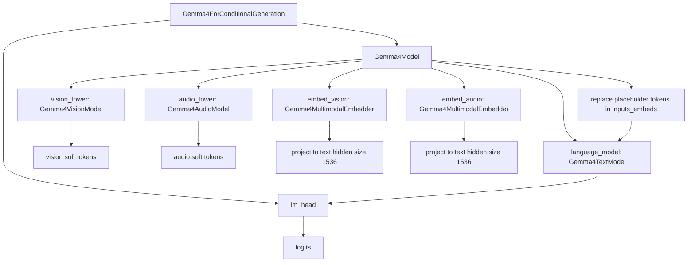
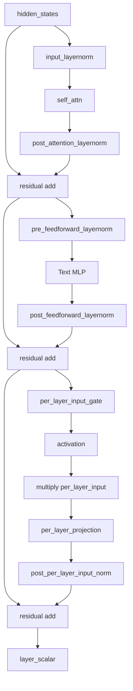
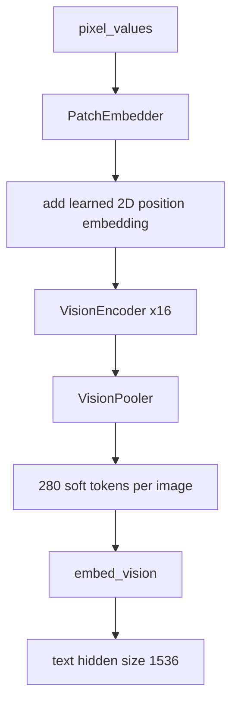
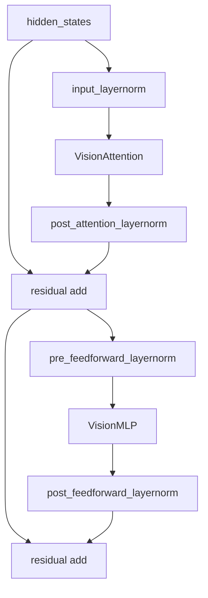
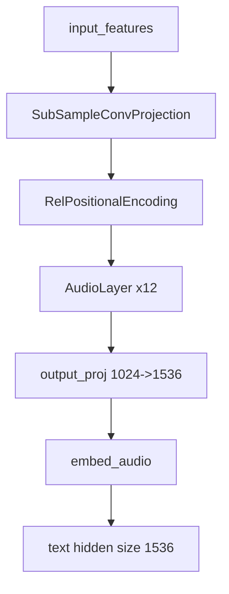
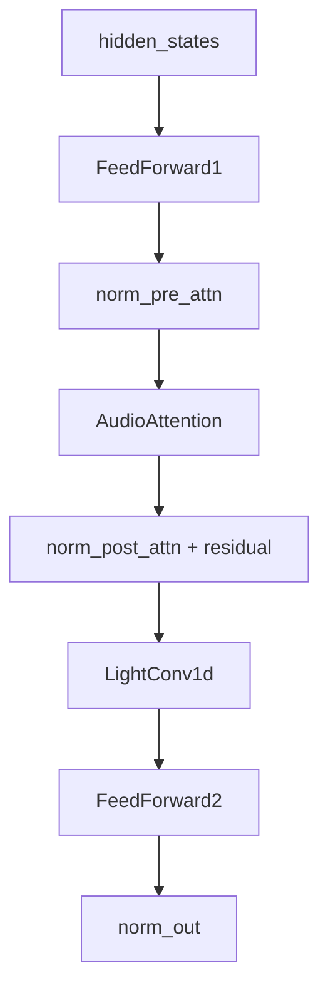
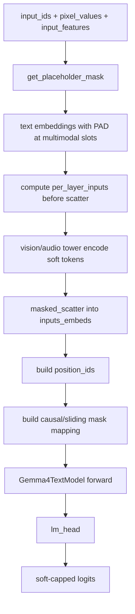

# Gemma4ForConditionalGeneration 架构分析

本文基于以下对象整理：

- 示例脚本：/data01/home/huxing/xh2modelzoo/examples_merak/llm/gemma4_e/debug_scripts/demo.py
- 本地 checkpoint：/data01/datasets/gemma-4-E2B-it/
- 本机 Transformers 实现：/data01/home/huxing/miniconda3/lib/python3.13/site-packages/transformers/models/gemma4/modeling_gemma4.py

说明：你原问题里提到“价格”，从上下文看更像是在问“规模/体量/参数预算”。本文按“模型规模与参数量”理解；checkpoint 本身不包含商业定价信息。

## 1. 一页结论

Gemma4ForConditionalGeneration 不是一个单纯的 decoder-only 文本模型，而是一个三塔式多模态模型：

- 文本主干：Gemma4TextModel，负责真正的自回归解码。
- 视觉塔：Gemma4VisionModel，把图像 patch 编码成 soft tokens，再投影到文本隐藏维度。
- 音频塔：Gemma4AudioModel，把音频特征编码成 soft tokens，再投影到文本隐藏维度。
- 顶层多模态桥：Gemma4Model，把 image/audio/video placeholder 替换成 soft tokens，然后送入文本主干。
- 语言建模头：Gemma4ForConditionalGeneration.lm_head，负责输出 logits。

当前本地 E2B-it checkpoint 的关键事实：

- Text：35 层，hidden size = 1536，8 个 attention heads，KV heads = 1。
- Vision：16 层，hidden size = 768，12 个 heads，patch size = 16。
- Audio：12 层，hidden size = 1024，8 个 heads，chunked local attention。
- 上下文长度：128K。
- 文本层类型：28 层 sliding attention + 7 层 full attention。
- KV 共享：从第 15 层开始，共 20 层共享 KV bank。
- PLE：启用了 per-layer input embedding，维度 256。
- 小模型特征：`use_double_wide_mlp=True`，共享 KV 区间内的 MLP 会变成双宽。

## 2. 模型规模

### 2.1 本地实例化后的原始参数量

以下统计来自 `Gemma4ForConditionalGeneration(cfg)` 的空权重实例，不依赖实际加载权重值：

| 部分 | 参数量 | 约合 |
| --- | ---: | ---: |
| total | 5,525,831,200 | 5.526B |
| language_model | 4,647,449,856 | 4.647B |
| vision_tower | 167,364,608 | 167.365M |
| audio_tower | 304,824,608 | 304.825M |
| embed_vision | 1,179,648 | 1.180M |
| embed_audio | 2,359,296 | 2.359M |
| lm_head | 402,653,184 | 402.653M |
| text_block_0 | 36,184,064 | 36.184M |
| vision_block_0 | 9,440,384 | 9.440M |
| audio_block_0 | 25,180,288 | 25.180M |

### 2.2 为什么官方 README 说 E2B，但这里是 5.5B

Gemma 4 README 把 E2B 标成 “2.3B effective (5.1B with embeddings)”。这里的 “effective” 不是简单的 `sum(p.numel())`。

Gemma 4 小模型使用了 PLE，也就是 per-layer embeddings。官方把这类主要用于查表的参数和真正每步都激活的参数区分开看，所以：

- “effective params” 更接近每步计算里真正活跃的参数量。
- 直接实例化后的 raw parameter count 则会把 embedding、LM head、vision/audio 塔、PLE 全部算进去。

因此，E2B-it 在 HF 实现下看到约 5.53B 的原始参数量，并不和官方“2.3B effective”矛盾。

## 3. 配置与层级事实

### 3.1 Text 配置

当前 text_config 的关键字段：

| 字段 | 值 |
| --- | --- |
| hidden_size | 1536 |
| intermediate_size | 6144 |
| num_hidden_layers | 35 |
| num_attention_heads | 8 |
| num_key_value_heads | 1 |
| head_dim | 256 |
| global_head_dim | 512 |
| sliding_window | 512 |
| max_position_embeddings | 131072 |
| hidden_size_per_layer_input | 256 |
| num_kv_shared_layers | 20 |
| use_double_wide_mlp | True |
| enable_moe_block | False |

layer type 分布：

- Full attention 层索引：4, 9, 14, 19, 24, 29, 34
- Sliding attention 层数：28
- Full attention 层数：7
- KV sharing 起点：15

### 3.2 Vision 配置

| 字段 | 值 |
| --- | --- |
| hidden_size | 768 |
| intermediate_size | 3072 |
| num_hidden_layers | 16 |
| num_attention_heads | 12 |
| num_key_value_heads | 12 |
| head_dim | 64 |
| patch_size | 16 |
| pooling_kernel_size | 3 |
| position_embedding_size | 10240 |
| vision_soft_tokens_per_image | 280 |

### 3.3 Audio 配置

| 字段 | 值 |
| --- | --- |
| hidden_size | 1024 |
| num_hidden_layers | 12 |
| num_attention_heads | 8 |
| output_proj_dims | 1536 |
| attention_chunk_size | 12 |
| attention_context_left | 13 |
| attention_context_right | 0 |
| conv_kernel_size | 5 |
| subsampling_conv_channels | [128, 32] |

## 4. Model-wise 结构

从功能上看，Gemma4ForConditionalGeneration 的职责可以分成三段：

1. 先把图像、音频、视频编码成 text hidden size 上的 soft tokens。
2. 再把这些 soft tokens 替换到文本占位 token 的位置。
3. 最后走标准的自回归文本解码并输出 logits。

## 5. Text 主干结构

### 5.1 Text stack 的两个阶段

Gemma4 E2B-it 的 35 层文本主干可以分成两个阶段：

- 第 0 到 14 层：独立 KV 层。
- 第 15 到 34 层：共享 KV 层，同时 MLP 双宽。

更具体地说：

- 第 13 层是最后一个非共享 sliding 层，它负责存储后续 sliding 层可复用的 full-length KV。
- 第 14 层是最后一个非共享 full-attention 层，它负责存储后续 full-attention 层可复用的 full-length KV。
- 第 15 到 34 层中：
  - 所有 sliding 层复用 layer 13 的 shared KV bank。
  - 所有 full-attention 层复用 layer 14 的 shared KV bank。

这意味着后 20 层不是“每层都单独扩张 KV cache”，而是按 attention 类型复用两个关键 KV 源。

```mermaid
flowchart LR
    subgraph P0[Layers 0-14: Non-shared KV]
        L0[0 S] --> L1[1 S] --> L2[2 S] --> L3[3 S] --> L4[4 F]
        L4 --> L5[5 S] --> L6[6 S] --> L7[7 S] --> L8[8 S] --> L9[9 F]
        L9 --> L10[10 S] --> L11[11 S] --> L12[12 S] --> L13[13 S]
        L13 --> L14[14 F]
    end

    subgraph KVBank[Shared KV Banks]
        KS[Sliding KV bank from layer 13]
        KF[Full KV bank from layer 14]
    end

    subgraph P1[Layers 15-34: Shared KV + Double-wide MLP]
        L15[15 S] --> L16[16 S] --> L17[17 S] --> L18[18 S] --> L19[19 F]
        L19 --> L20[20 S] --> L21[21 S] --> L22[22 S] --> L23[23 S] --> L24[24 F]
        L24 --> L25[25 S] --> L26[26 S] --> L27[27 S] --> L28[28 S] --> L29[29 F]
        L29 --> L30[30 S] --> L31[31 S] --> L32[32 S] --> L33[33 S] --> L34[34 F]
    end

    L13 -.store_full_length_kv.-> KS
    L14 -.store_full_length_kv.-> KF
    KS -.reused by sliding layers 15-34.-> L15
    KF -.reused by full layers 19/24/29/34.-> L19
```

S = sliding attention，F = full attention。

### 5.2 Text block 内部结构

一个 Gemma4TextDecoderLayer 的结构不是“Attn + MLP”这么简单，它多了两层额外设计：

- PLE/per-layer input 分支。
- layer_scalar 缩放。

E2B-it 的 layer 0 模块 repr 可对应到以下结构：

- `input_layernorm`
- `self_attn`
- `post_attention_layernorm`
- `pre_feedforward_layernorm`
- `mlp`
- `post_feedforward_layernorm`
- `per_layer_input_gate`
- `per_layer_projection`
- `post_per_layer_input_norm`

### 5.3 Attention 细节

Gemma4TextAttention 的几个关键点：

- sliding 层使用 `head_dim=256`。
- full 层使用 `global_head_dim=512`。
- `num_key_value_heads=1`，所以本质上是强 GQA/MQA 风格。
- Q/K/V 在进入注意力前都会做 norm，其中 V 也单独做了 `v_norm`。
- RoPE 是按 layer type 分开算的：
  - sliding：默认 RoPE，`theta=10000`
  - full：proportional RoPE，`theta=1000000`，并只对部分 rotary 维度应用

对 E2B-it：

- 非共享 sliding 层的形状：
  - `q_proj`: 1536 -> 2048
  - `k_proj`: 1536 -> 256
  - `v_proj`: 1536 -> 256
- 非共享 full 层的形状：
  - `q_proj`: 1536 -> 4096
  - `k_proj`: 1536 -> 512
  - `v_proj`: 1536 -> 512

### 5.4 MLP 与 PLE 细节

Text MLP 采用 gate/up/down 三投影结构：

- `gate_proj(x)` 和 `up_proj(x)` 先分别投影。
- `act(gate_proj(x)) * up_proj(x)` 做逐元素门控。
- 然后 `down_proj` 回到 hidden size。

对 E2B-it：

- 第 0 到 14 层：`intermediate_size = 6144`
- 第 15 到 34 层：因为 `use_double_wide_mlp=True` 且处于 shared-KV 区，MLP 会扩成双宽，即 `12288`

PLE 的意义：

- 除主 embedding 外，每一层还有一份较小的 per-layer embedding。
- 在多模态场景下，这个 per-layer input 需要在 soft token 替换前就根据原始 `input_ids` 提前计算好。
- 这也是 `Gemma4Model.forward()` 里先算 `per_layer_inputs` 再做 image/audio soft token scatter 的原因。

## 6. Vision 塔结构

Vision 编码器是一个独立 Transformer encoder：

- `Gemma4VisionPatchEmbedder`
- `Gemma4VisionEncoder(16 layers)`
- `Gemma4VisionPooler`
- `embed_vision` 把 vision hidden 从 768 映射到 text hidden 1536

### 6.1 Vision block 内部结构

Vision block 基本是标准 PreNorm Transformer block：

### 6.2 Vision 细节

- patch size = 16，所以输入图像先被切成 patch。
- patch embed 后会叠加 learned 2D position embedding。
- VisionAttention 用二维 RoPE，`pixel_position_ids` 是二维坐标。
- encoder 输出后会进入 pooler，把 patch token 按空间位置平均池化成固定数量 soft tokens。
- 对当前 checkpoint，每张图默认输出 280 个 vision soft tokens。

## 7. Audio 塔结构

Audio 塔不是标准文本 Transformer，而是更接近轻量 Conformer/USM 风格：

- Subsample conv projection
- Relative positional encoding
- AudioLayer x 12
- output projection 到 1536
- `embed_audio` 再归一化并对齐文本隐藏空间

### 7.1 Audio block 内部结构

一个 AudioLayer 的内部顺序是：

- FeedForward1
- Chunked local self-attention
- LightConv1d
- FeedForward2
- 输出 norm

### 7.2 Audio 细节

- AudioAttention 不是全局注意力，而是 chunked local attention。
- 配置里 `attention_chunk_size=12`，`attention_context_left=13`，`attention_context_right=0`。
- 注意力会把序列切成块，对每块取一个有限上下文窗口。
- AudioLayer 中间的 `LightConv1d` 包含：
  - 线性升维
  - GLU
  - depthwise causal conv1d
  - norm + SiLU + 线性回投

这说明音频塔强调局部时序建模，而不是复制文本塔的全局 decoder 结构。

## 8. 多模态推理流程

Gemma4ForConditionalGeneration 的推理可以分成两段：

- Prefill：第一次把文本和图像/音频一起送进去，建立 KV cache。
- Decode：之后每步只送最新 token，并复用已有 cache。

### 8.1 Prefill 流程

对应 `Gemma4Model.forward()`，关键细节如下：

1. 先找 placeholder token。
   - image token id = 258880
   - audio token id = 258881
   - video token id = 258884

2. 若输入是 `input_ids`，会先把 placeholder 位置替换成 PAD token，再做文本 embedding。
   - 这样可以避免 multimodal placeholder 越界或占用错误 embedding。

3. 如果启用了 PLE，会先用原始文本 token 计算 `per_layer_inputs`。
   - 这是在多模态 scatter 之前完成的，因为替换成 soft tokens 后就不能再从 `inputs_embeds` 逆推出原 token id。

4. vision/audio 塔单独编码：
   - 图像输出 280 个 soft tokens，再经 `embed_vision` 投到 1536。
   - 音频输出 1536 维 soft tokens，再经 `embed_audio` 归一化与投影。

5. 使用 `masked_scatter` 把 soft tokens 覆盖到文本占位位置。
   - 代码里会严格校验“placeholder token 数量”和“soft token 数量”是否一致。

6. 构造 `position_ids` 和 attention mask。
   - 对当前 E2B-it，`use_bidirectional_attention=None`，所以它走的是常规 causal mask 分支，不是大模型里那种对 vision token 开特殊双向 mask 的路径。

7. 进入 language model。
   - sliding 层用 sliding mask。
   - full 层用 full causal mask。
   - RoPE 按 layer type 分开生成。

### 8.2 Decode 流程

decode 时最重要的点不是重新跑 vision/audio，而是复用 cache。

`prepare_inputs_for_generation()` 做了两件关键事：

- 调用父类的 generation 裁剪逻辑，只保留当前步需要的 token。
- 如果不是 first iteration 且 `use_cache=True`，会把 `pixel_values`、`pixel_values_videos`、`input_features`、`input_features_mask` 从后续步里丢掉。

也就是说：

- 第一步：多模态编码器参与计算。
- 后续步：只保留文本解码路径，视觉/音频内容通过已建立的序列上下文和 cache 生效。

## 9. 关键源码细节总结

### 9.1 Text 路径最值得关注的点

1. Hybrid attention：35 层里 full attention 每 5 层出现一次，并保证最后一层一定是 full。
2. KV sharing：从第 15 层开始，后面 20 层不是各自维护完整 KV，而是按 sliding/full 两类复用第 13 层和第 14 层的 KV bank。
3. Double-wide MLP：共享 KV 区的层，MLP 中间维度从 6144 扩到 12288。
4. PLE：每层都有额外的小 embedding 输入分支，维度 256。

### 9.2 Vision 路径最值得关注的点

1. 输入先做 patchify 和 learned 2D position embedding。
2. attention 中使用 2D RoPE。
3. encoder 后不是直接把全部 patch token 扔给 LLM，而是经过 pooler 压成固定数目的 soft tokens。

### 9.3 Audio 路径最值得关注的点

1. 两层 subsampling conv 先压缩序列。
2. 主体层是 FFN + local attention + light conv + FFN 的 Conformer 风格。
3. attention 是分块局部注意力，不是全局自注意力。

## 10. 对 Merak 适配最关键的观察点

如果后面要把 Gemma4 迁到 Merak/xhmodel_merak，这个模型最难的地方不在普通线性层，而在下面几点：

1. Text 主干不是统一形态。
   - sliding/full 两类 attention 的 head_dim 和 rope 参数不同。

2. KV cache 不是简单的一层一组。
   - 需要处理 shared KV bank 的读写和复用语义。

3. PLE 不是标准 LLM 路径。
   - `per_layer_inputs` 必须在 multimodal soft token merge 前准备好。

4. 多模态 merge 是顶层逻辑的一部分。
   - image/audio/video placeholder 与 soft token 数量必须严格对齐。

5. Audio 塔不是文本塔模板可直接复用的结构。
   - 它更像独立 encoder，需要单独建图。

## 11. 最后的判断

Gemma4ForConditionalGeneration 的本质不是“给文本模型外挂一个 vision encoder”，而是：

- 一个带 PLE 的小型高效文本主干
- 一个混合 attention 调度器
- 一个共享 KV 的长上下文缓存方案
- 两个把非文本模态变成 text hidden soft tokens 的前端编码器

因此它的设计重心很明确：

- 让小模型维持长上下文和多模态能力
- 用 sliding/full hybrid attention 降低成本
- 用 shared KV + PLE 降低运行时和参数活跃成本
- 让 vision/audio 只在 prefill 参与重计算，decode 尽量退化成普通文本生成
