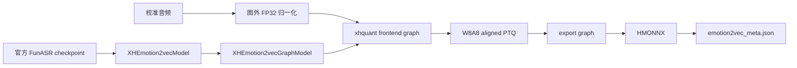
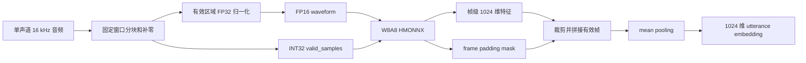

# emotion2vec Merak 适配说明

本目录实现 `emotion2vec_plus_large` 在 Merak/XH2a 上的模型注册、xhquant-native 计算图、W8A8 HMONNX 导出和运行时推理。

默认模型为 `iic/emotion2vec_plus_large`：

- 输入：单声道 16 kHz 波形；
- 固定 HMONNX 窗口：16 秒，即 `[1, 256000]`；
- 输出：帧级 1024 维特征和对应 padding mask；
- 默认量化类型：`w8a8h1_sefp`；
- 波形归一化：图外 FP32；
- HMONNX 神经网络输入：FP16 波形和 INT32 `valid_samples`；
- 神经网络主体：xhquant-native Conv、Linear、MatMul、Softmax 等算子。

## 文件职责

### `__init__.py`

包级公共接口。

它集中导出外部常用的配置、模型、HMONNX 推理类、浮点参考桥接和 xhquant 图类，使调用方无需了解内部文件拆分。

主要导出：

- `XHEmotion2vecConfig`
- `XHEmotion2vecModel`
- `XHEmotion2vecGraphModel`
- `Emotion2vecHMONNXModel`
- `Emotion2vecExportBridge`
- `Emotion2vecModelMeta`

### `audio_utils.py`

纯音频数据处理工具，不包含模型结构。

主要职责：

- 校验采样率、单声道形状和非空输入；
- 将长音频切成固定 256000 samples 窗口并补零；
- 仅使用有效采样区域执行 FP32 均值/方差归一化；
- 按卷积参数计算有效输出帧数；
- 根据 frame padding mask 裁剪有效特征；
- 对有效帧执行 masked mean pooling。

`normalize_padded_waveform()` 是当前数值设计中的关键函数。它只统计前 `valid_samples` 个采样点，并保持 padding 区域为零：

$$
\mu=\frac{1}{L}\sum_{i=0}^{L-1}x_i,
\qquad
\sigma^2=\frac{1}{L}\sum_{i=0}^{L-1}(x_i-\mu)^2
$$

$$
\hat{x}_i=
\begin{cases}
\dfrac{x_i-\mu}{\sqrt{\sigma^2+10^{-5}}}, & i<L\\
0, & i\ge L
\end{cases}
$$

归一化放在图外 FP32 完成，避免较大的 `valid_samples` 转换成 FP16 时发生溢出。

### `configuration_emotion2vec.py`

定义模型配置和导出元数据。

`XHEmotion2vecConfig` 负责描述：

- 模型名称与注册类型；
- 官方 checkpoint 目录；
- ModelScope 模型 ID；
- 采样率、固定窗口和特征维度；
- XH2a 芯片架构；
- 默认 W8A8 量化方案；
- `use_cache=False` 等模型运行属性。

`Emotion2vecModelMeta` 描述导出产物，包括：

- HMONNX 相对路径；
- 采样率和窗口长度；
- 输出特征维度；
- 校准音频路径；
- 完整模型配置。

运行时通过 `Emotion2vecModelMeta.from_json_file()` 加载 `emotion2vec_meta.json`，并将其中的相对产物路径解析为相对于 metadata 文件的绝对路径。

### `modeling_emotion2vec.py`

官方 FunASR PyTorch 模型的加载和浮点参考桥接层。

主要职责：

- 通过 FunASR `AutoModel` 加载官方 emotion2vec checkpoint；
- 从不同形式的官方返回值中提取 frame features 和 padding mask；
- 使用 `Emotion2vecExportBridge` 构造官方浮点参考输出；
- 为 Golden 对齐提供 PyTorch FP32 基准。

`Emotion2vecExportBridge` 保留官方模型调用协议，例如：

- `features_only=True`；
- `remove_extra_tokens=True`；
- 根据 `valid_samples` 生成 sample padding mask；
- 返回帧级特征和 frame padding mask。

该文件主要用于加载官方权重和产生参考结果，不是最终 HMONNX 内部的神经网络实现。

### `xhquant_graph.py`

核心 xhquant-native 神经网络图实现。

它将官方 FunASR emotion2vec+ Large 的网络结构和权重转换为可被 xhquant frontend、PTQ 和 HMONNX exporter 处理的图。

主要组件：

- `XHEmotion2vecFrameMask`：使用 INT32 `valid_samples` 计算卷积后有效帧数和 frame padding mask；
- `XHEmotion2vecFeatureEncoder`：七层 xhquant `XHConv1d` 音频特征编码器；
- `XHEmotion2vecPositionEncoder`：卷积相对位置编码器；
- `XHEmotion2vecSelfAttention`：基于 `XHLinear`、`MatMul` 和 `Softmax` 的多头注意力；
- `XHEmotion2vecMLP`：基于 `XHLinear` 和 `Gelu` 的前馈网络；
- `XHEmotion2vecTransformerBlock`：attention、MLP、残差和 LayerNorm；
- `build_alibi_bias()`：构建适配 16 个 attention heads 的 ALiBi bias；
- `XHEmotion2vecGraphModel`：组合卷积前端、extra tokens、4 层 Audio context encoder 和 8 层主干 Transformer。

这个文件假设输入波形已经在图外完成 FP32 归一化，不再在图中计算波形均值和方差。

`valid_samples` 在图中保持 INT32，仅用于：

1. 逐层计算卷积输出长度；
2. 生成 frame padding mask；
3. 屏蔽无效音频帧。

### `emotion2vec_model.py`

Merak 模型封装和 HMONNX 导出入口。

`XHEmotion2vecModel` 通过 `register_llm_model()` 注册为 `Emotion2vecForSequenceEmbedding`，使 `AutoLLMConfig`、`AutoLLMModel` 和 `AutoLLMWorkflow` 能按配置自动找到它。

主要职责：

- 加载官方 FunASR checkpoint；
- 调用 `XHEmotion2vecGraphModel.from_funasr()` 复制模型结构和权重；
- 提供 PTQ calibration dummy input；
- 使用图外 processor 对 calibration waveform 做 FP32 归一化；
- 通过临时 ONNX 将 PyTorch/xhquant wrapper 转成 xhquant frontend graph；
- 执行 Merak 状态链：wrap、frontend、W8A8 aligned PTQ、export graph、HMONNX；
- 创建 `Emotion2vecModelMeta`。

这里的临时 ONNX 只是 xhquant frontend 中转格式。最终交付产物仍是经过 xhquant PTQ 和 export graph 转换的 HMONNX。

### `workflow.py`

emotion2vec 的标准 workflow 编排类。

`Emotion2vecWorkflow` 继承 `BaseLLMWorkflow`，由 `XHEmotion2vecModel.WORKFLOW_CLS` 声明并通过 `AutoLLMWorkflow.from_config()` 自动加载。

主要职责：

- 复用标准 workflow 的模型配置解析和导出过程；
- 校验最终配置类必须是 `XHEmotion2vecConfig`；
- 校验最终模型类必须是 `XHEmotion2vecModel`；
- 在导出完成后写出 `emotion2vec_meta.json`；
- 通过统一的 `dump_golden()` API 加载官方 FunASR FP32 模型并生成帧级和句级 Golden。

对应 checked-in YAML 位于：

`configs_merak/workflows/xh2a/audio_models/emotion2vec/emotion2vec_plus_large_xh2a_w8a8_16s.yaml`

YAML 中 `quant: null` 表示不额外生成一份量化后的 Hugging Face 权重目录，不表示禁用 HMONNX 量化。实际 W8A8 PTQ 由 `XHEmotion2vecModel.export_hmonnx()` 的模型状态链完成。

### `emotion2vec_hmonnx_inference.py`

HMONNX 运行时封装。

`Emotion2vecHMONNXModel` 负责：

- 从 metadata 定位 HMONNX；
- 初始化 `HMONNXInferenceV2` 或兼容的 Golden runtime；
- 将长音频切成固定窗口；
- 对每个窗口执行图外 FP32 归一化；
- 将 waveform 转为 FP16、`valid_samples` 转为 INT32；
- 调用 HMONNX；
- 删除 padding frames；
- 拼接多个窗口的有效帧；
- 对全部有效帧求均值，得到 utterance embedding。

它是实际部署或离线提取特征时使用的主入口。

### `iemocap_protocol.py`

IEMOCAP 下游情感分类评估的协议工具。

它定义：

- 四分类标签：`ang`、`hap`、`neu`、`sad`；
- `exc` 合并到 `hap` 后的五个 Session 样本数；
- utterance ID 到 Session 的解析；
- leave-one-session-out 拆分辅助函数；
- WA、UA 和 weighted F1 指标计算。

该文件不参与 HMONNX 导出和普通音频推理。只有在使用授权的 IEMOCAP 原始数据运行下游精度评估时才会使用。

## 导出数据流



标准导出入口为：

```bash
python examples_merak/audio/emotion2vec/export_hmonnx.py \
    --model-dir data/models/emotion2vec_plus_large \
    --config-path configs_merak/workflows/xh2a/audio_models/emotion2vec/emotion2vec_plus_large_xh2a_w8a8_16s.yaml \
    --output-dir work_dirs/emotion2vec_plus_large_xh2a_w8a8_16s
```

## 推理数据流



## 关键精度与类型边界

| 阶段 | 数据类型或量化方式 | 说明 |
|---|---|---|
| 音频读取 | FP32 | 图外处理 |
| 波形归一化 | FP32 | 只统计有效采样区域 |
| HMONNX waveform 输入 | FP16 | 固定形状 `[1, 256000]` |
| HMONNX `valid_samples` 输入 | INT32 | 不转换为 FP16 |
| Conv、Linear、MatMul 主体 | 默认 W8A8 | `w8a8h1_sefp` |
| frame padding mask | BOOL | 屏蔽补零产生的无效帧 |
| utterance pooling | FP32 | 图外对有效帧求均值 |

## 与 examples 目录的关系

本目录提供模型实现和可复用运行时，用户入口位于 `examples_merak/audio/emotion2vec/`：

- `export_hmonnx.py`：运行标准 workflow 导出；
- `hmonnx_infer.py`：执行单音频 HMONNX 推理；

辅助调试入口位于 `examples_merak/audio/emotion2vec/debug/`：

- `download_model.py`：下载官方权重；
- `compare_golden.py`：比较官方 PyTorch 与 W8A8 HMONNX；
- `iemocap_hmonnx_eval.py`：可选的 IEMOCAP 下游评估入口。

其中 IEMOCAP 评估依赖授权数据，不属于基础 HMONNX 导出和 Golden 验收的必经步骤。
